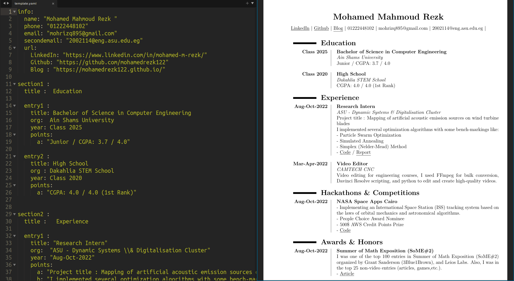

# CV.py
<!-- <p align="center"></p> -->

[](https://github.com/TheBSD/StandWithPalestine/blob/main/docs/README.md)

<p align="center"></p>


`CV.py`  is  a simple conversion of yaml file containing the CV information in a hierarchical order to a nice and elegant LaTeX file that is fed to an API for compilation. And you have your CV PDF file on local machine as simple as that. The main point is that you do not have to have LaTeX or know how it is written, just enjoy the good-looking, well-structured, and fault-proof PDF file. 

## CHANGELOG
- Replacing repeated snippets way to latex MACROS producing cleaner tex file.
- Adding local compilation functionality (e.g. with `pdflatex`, `xelatex`, etc.) 
- Adding configuration options in form of yaml file
- Packaging the program for easy use across the local machine.
- Replacing `argparse` with `Click`, simpler and more elegant.
- Caching requests, avoiding unnecessary calls to the API if there is no change in the request content.
``
## Installation

- [optional] git, or you can download the source as `.zip` from github gui.
```
git clone https://github.com/mohamedrezk122/CV.py
```
- [Python 3](https://www.python.org/downloads/)  and pip 
- Open ```cmd```  if you are on Windows, or ```terminal``` in case of Linux, Mac, or BSD. 

NOTE: This installation method makes the script accessible from any directory in your machine, which means that you don't have to be inside the code source dir to execute the program.  

``` sh
$ cd CV.py
$ pip3 install -e .
```
or 
``` sh
$ cd CV.py
$ python3 setup.py
```

## Usage

You can use the following command for help :
``` sh
$ cv-dot-py --help
Usage: cv-dot-py [OPTIONS] FILENAME

  "Enjoy your well-structured CV pdf file" - Mohamed Rezk

Options:
  -o, --output PATH  Output file path, default output.pdf  [default: output]
  -d, --dry_run      Only write the tex file, NO pdf file will be produced
  -t, --tex          Write tex file along with the pdf
  -l, --local TEXT   Compile the tex file locally without an api call, you
                     should pass a compiler
  --help             Show this message and exit.
```

The script can be used as follows:

- generate pdf file but not tex file 
``` sh
$ cv-dot-py input.yaml -o my_cv 
```
- generate pdf file and tex file 
``` sh
$ cv-dot-py input.yaml -o my_cv -t  
```
- generate only tex file 
``` sh
$ cv-dot-py input.yaml -o my_cv -d  
```


However, `-o` is an optional argument , if it is not specified like the command below , the script generates the PDF file under the name of  `output.pdf` likewise,  `output.tex`.    

``` s
$ cv-dot-py input.yaml 
```

All output files will be written in current working directory (folder). Basically the one you call the script from.

- use local compiler 
``` sh
$ cv-dot-py input.yaml -l pdflatex
```

## yaml file format

`NOTE`: The template does not reflect my actual CV information, so do not take it seriously.

Please browse `template.yaml` under examples for additional help on  how the yaml file is properly formatted, also you can see the corresponding PDF file produced by the script under the name `template.pdf`.
The supported structure of the file:

`info`, `section`, `entry` , `multicol`

### ```info```  field

- it is one-time field (written once)
- name is a required parameter 
- you can add any number of information points / keys (like phone, work phone, etc.) 
- points under ```url``` key takes the name of key and embed  the corresponding URL inside the key like so ("https://github.com/mohamedrezk122")[Github] 

```yaml
info:
  name: "Mohamed Mahmoud Rezk "
  phone: "01222448102"
  email: "mohrizq895@gmail.com"
  secondemail: "2002114@eng.asu.edu.eg"
  url:
    LinkedIn: "https://www.linkedin.com/in/mohamed-m-rezk/"
    Github: "https://github.com/mohamedrezk122"
    Blog : "https://mohamedrezk122.github.io/"
```

### ```section```  field

- section has to be unique , meaning no  two section have the same name , it shall take the form ```section+digit```  like ```section1``` or ```section+digit+digit``` like ```section12``` , these are the accepted formats.  
- section must have ```title``` key
- under section you can use either ```entry```  or ```multicol``` ( discussed below)

``` yaml
section2 :
  title :   Experience 
  entry1 : 
    title: "Research Intern"
    org:  "ASU - Dynamic Systems and Digitalisation Cluster"
    year: "Aug-Oct-2022"
    points:
      a: "Project title:Mapping of artificial acoustic emission sources on wind turbine blades "
      b: "I implemented several optimization see algorithms with some bench-markings like:"
      c: "- Particle Swarm Optimization"
      d: "- Simulated Annealing"
      e: "- Simplex (Nelder-Mead) Method"
      f: "see [code]"
    url:
      code: "https://github.com/mohamedrezk122/AE-software"
```

### ```entry```  field

- entry has to be unique within the same section , meaning no  two entries have the same name under the same section , it shall take the form ```entry+digit```  like ```entry1``` or ```entry+digit+digit``` like ```entry12``` , these are the accepted formats.  
- entry must have ```title``` key
- the accepted  ```entry``` attributes are  ```title``` , ```org``` , ```year```,```points```,```url```

``` yaml
section2 :
  title :   Experience 
  entry1 : 
    title: "Research Intern"
    org:  "ASU - Dynamic Systems and Digitalisation Cluster"
    year: "Aug-Oct-2022"
    points:
      a: "Project title:Mapping of artificial acoustic emission sources on wind turbine blades "
      b: "I implemented several optimization see algorithms with some bench-markings like:"
      c: "- Particle Swarm Optimization"
      d: "- Simulated Annealing"
      e: "- Simplex (Nelder-Mead) Method"
      f: "see [code]"
    url:
      code: "https://github.com/mohamedrezk122/AE-software"
```

### ```multicol```  field

- multicol has to be unique within the same section , meaning no  two multicol fields have the same name under the same section , it shall take the form ```multicol+digit```  like ```multicol1``` or ```multicol+digit+digit``` like ```multicol12``` , these are the accepted format.  
- the accepted  ```entry``` attributes are  ```ncols``` ,```points```
- if ```ncols``` is not specified , it is 3 by default.

``` yaml
section3:
  title: Skills

  multicol1:
    cols: 3
    points:
      a: HTML
      b: CSS
      c: Vanilla JS
      d: SCSS
      e: Node.js
      f: React.js
      g: Three.js
      h: Electron.js
      k: Version Control (git)
      h: Responisve Design
      s: MySQL
```
## Notes and limitations

- you can edit margins through `config.yaml`
- if there is a `:` , colon inside the text your writing inside the yaml file you have to put the whole string inside quotations like so  `"some text : some text"`
- if you violated the naming convention of entry, section, or multicol, the field will not be written to the PDF file so double check.
- if two same-level fields have the same name the latter only will be written.
- the order used by the script is positional order meaning that regardless the digit in front of the field , the script processes the file in a chronological order.
- if there is a `$` , `&` or `%` you need to escape it and put the whole string in `""` like so `"some text  \\$ some text"`
 
